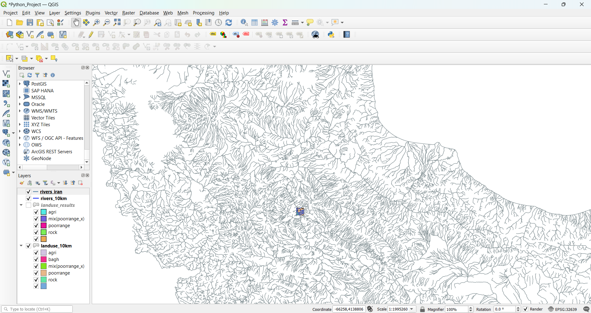
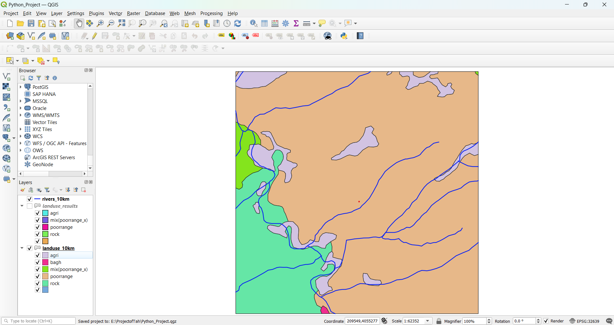
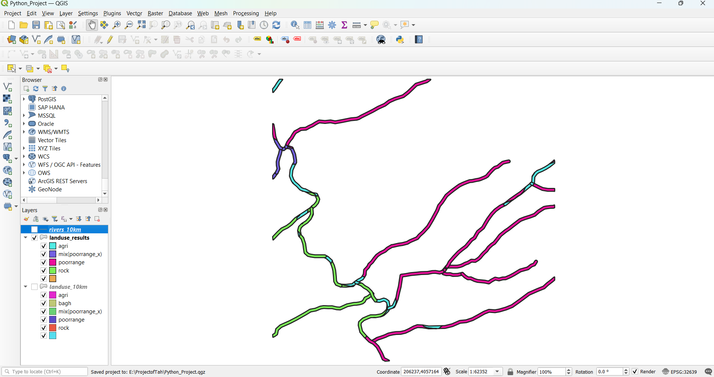
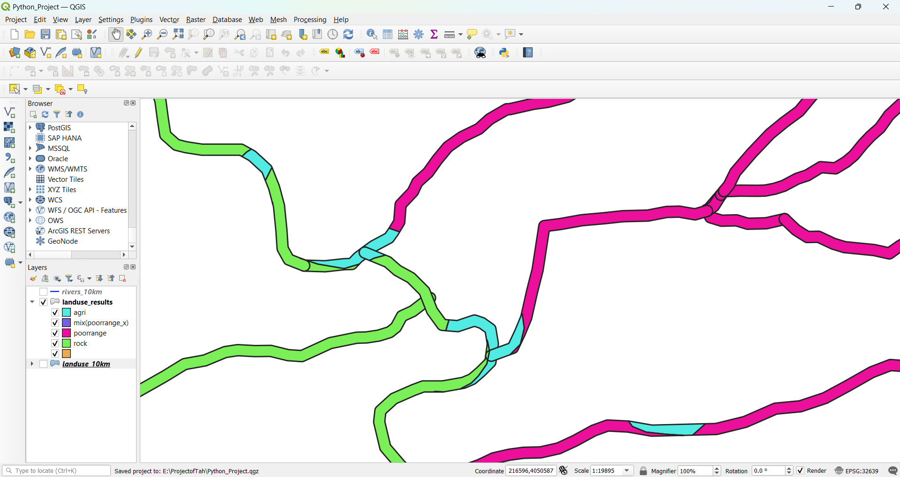

# Spatial Analysis with Python and PostgreSQL

## Introduction

This project focuses on analyzing spatial data related to land use and watercourses in Iran. The goal is to apply spatial constraints and perform spatial analysis using Python and a PostgreSQL database.

### Data Preparation

1. **Input Data**: The project uses two primary datasets:
   - **Land Use Data**: A detailed vector layer representing various land use types. [Download Link](https://s17.picofile.com/d/8419657776/620b9d12-57d8-4410-8ff5-494a5cb64b63/landuse_iran.zip)
   - **Watercourses Data**: A vector layer representing rivers and other watercourses in Iran. [Download Link](https://s9.picofile.com/d/8328769184/5a91c282-308d-4b1b-a38c-741e32d272d4/River.rar)

2. **Preprocessing**: Using QGIS, the datasets were preprocessed to focus on a specific region of interest measuring 10 km x 10 km. This preprocessing included clipping and aligning the data to the desired region.

3. **Import to PostgreSQL**: The preprocessed data was imported into PostgreSQL using QGIS and the DB Manager. To enable spatial functionalities, the PostGIS extension was activated in the database with the following command.

   ```sql
   CREATE EXTENSION postgis;
    ``` 

    **Note:** The land use and watercourses input data for a 10 km extent of Northwestern Iran have been exported to the following directories:

    - `landuse_10km/landuse_10km.shp`
    - `watercourses_10km/watercourses_10km.shp`

    You can view these files in either QGIS or ArcGIS Pro.

## Installation

To set up the environment for this project, you need Python 3.9 or later and the required libraries. Use the `requirements.txt` file provided in the directory to install all necessary dependencies.

Ensure you have Python installed, then run:

```bash
pip install -r requirements.txt
```

## Configuration

### PostgreSQL Setup

1. **Install PostgreSQL**:
   - Ensure PostgreSQL is installed on your system.

2. **Create a Database**:
   - Create a new PostgreSQL database for this project. You can do this via the PostgreSQL command line or using a graphical tool like pgAdmin. For example, you can create a database named `PythonProject` using the following SQL command:
     ```sql
     CREATE DATABASE PythonProject;
     ```

3. **Restore the Database from Backup**:
   - Restore the database from the provided backup file `postgresql_backup_20240811.sql`. Use the `psql` command-line tool to execute the backup file. Run the following command in your terminal:
     ```bash
     psql -U postgres -d PythonProject -f postgresql_backup_20240811.sql
     ```

4. **Verify Configuration**:
   - Verify that the data has been restored correctly and the PostGIS extension is enabled by checking the database tables and spatial functions.

By following these steps, you'll set up the PostgreSQL database environment necessary for this project.

## Functions Overview

This project includes several functions to handle different aspects of the spatial analysis process. Below is a brief description of each function:

- **`get_engine(db_url)`**: 
  - **Description**: Creates and returns a SQLAlchemy engine for connecting to the PostgreSQL database.
  - **Parameters**: 
    - `db_url`: The database URL connection string.
  - **Returns**: SQLAlchemy engine object.

- **`load_vector_layer(engine, table_name, geom_col='geom')`**:
  - **Description**: Loads a vector layer from a PostgreSQL table into a GeoDataFrame.
  - **Parameters**: 
    - `engine`: SQLAlchemy engine object.
    - `table_name`: Name of the table in PostgreSQL.
    - `geom_col`: Name of the geometry column (default is `'geom'`).
  - **Returns**: GeoDataFrame containing the vector layer.

- **`apply_buffer_and_intersect(land_use_gdf, watercourses_gdf, buffer_distance)`**:
  - **Description**: Applies a buffer to watercourses and intersects the buffered watercourses with the land use data.
  - **Parameters**: 
    - `land_use_gdf`: GeoDataFrame containing land use data.
    - `watercourses_gdf`: GeoDataFrame containing watercourses data.
    - `buffer_distance`: Buffer distance in meters.
  - **Returns**: Filtered GeoDataFrame containing land use regions within the buffer zone.

- **`save_geodataframe_to_postgresql(gdf, engine, table_name)`**:
  - **Description**: Saves a GeoDataFrame to a PostgreSQL database table.
  - **Parameters**: 
    - `gdf`: GeoDataFrame to save.
    - `engine`: SQLAlchemy engine object.
    - `table_name`: Name of the table to save data into.
  - **Returns**: None.

- **`save_geodataframe_to_csv(gdf, file_path)`**:
  - **Description**: Saves a GeoDataFrame to a CSV file.
  - **Parameters**: 
    - `gdf`: GeoDataFrame to save.
    - `file_path`: File path for the CSV file.
  - **Returns**: None.

- **`main(db_url, land_use_table, watercourses_table, buffer_distance, output_table_name, output_csv_file)`**:
  - **Description**: Main function that coordinates the workflow: creates the database engine, loads vector layers, applies spatial constraints, and saves the results to both PostgreSQL and CSV.
  - **Parameters**: 
    - `db_url`: Database URL connection string.
    - `land_use_table`: Name of the land use table in PostgreSQL.
    - `watercourses_table`: Name of the watercourses table in PostgreSQL.
    - `buffer_distance`: Buffer distance in meters.
    - `output_table_name`: Name of the output table in PostgreSQL.
    - `output_csv_file`: Path to the output CSV file.
  - **Returns**: None.


## Usage

To execute the project and perform the spatial analysis, follow these steps:

1. **Run the Main Script**:
   - Navigate to the directory containing `main.py`.
   - Execute the script using Python. You can do this by running the following command in your terminal:
     ```bash
     python main.py
     ```

2. **Check the Logs**:
   - All logs related to the execution of the script are saved in the file `application.log` located in the directory where `main.py` is run. This log file will contain detailed information about the execution process, including any errors or status updates.

3. **View the Output**:
   - **Database Table**: The script will create a new table named `landuse_results` in the PostgreSQL database specified. This table contains the results of the spatial analysis and is stored in the database file `postgresql_backup_20240811.sql`.
   - **CSV File**: A CSV file named `filtered_land_use_results.csv` will also be created in the project directory. This file contains the results of the spatial analysis in a tabular format and can be opened with any CSV-compatible software or text editor.
   - **QGIS Visualization**: To verify the results visually, you have two options:

     1. **Load the `landuse_results` Table into QGIS**:

        You can load the `landuse_results` table directly into QGIS. The following image illustrates the output of the spatial analysis as visualized in QGIS.

      2. **Open the Exported Shapefile**:

          Alternatively, you can open the exported shapefile of the project’s result in either QGIS or ArcGIS Pro. The result shapefile can be found in the directory: `landuse_results/landuse_results.shp`.
    
     * **Region of Interest**: A 10 km x 10 km area located in Northwest of Iran:
       
     
     * **Both Layers**:
       
     * **Result of the Project**:
       

       

Please check the application.log file for detailed error messages in case of failures.

## Contact

For any questions or issues related to this project, please feel free to reach out via email:

- **Email**: [mo.alireza77habibi@gmail.com](mailto:mo.alireza77habibi@gmail.com)
